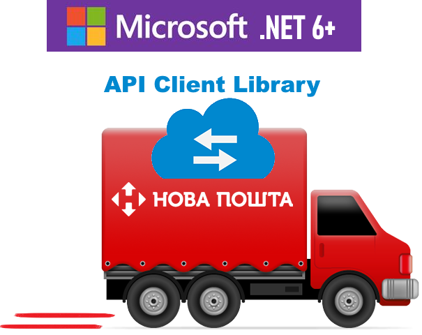

Язык: [English](README.md) | [Русский](README.ru.md) | [Українська](README.uk.md)

# SKit.NovaPoshta.Client

Клиент к веб-сервисам почтово-грузовой компании "[Нова пошта](https://novaposhta.ua/ru)".

Общие ограничения: **API версии 2**, **формат json**, **платформа .NET 6.0+**



## Реализация поддержки методов в моделях API 'Нова Пошта'

Под реализацией метода в клиенте подразумевается наличие в проекте базового теста для этого метода, успешный его проход.
Json-результаты запросов находятся в подпапках папки assets:

- **responseSamples** - результаты запроса с использованием [веб-приложения для разработчиков - developers.novaposhta.ua](https://developers.novaposhta.ua/documentation)
- **responseTestsOutput** - результаты теста в проекте клиента

Перед методом используется префикс `+x.x.x`, где `+` признак реализации, `x.x.x` - версия клиента

### Модель CommonGeneral

- **getMessageCodeText** - получение существующих описаний ошибок

### Модель Common

- +v1.0.0 **getTimeIntervals** - получение временных интервалов для города получателя
- +v1.0.0 **getCargoTypes** - получение списка доступных типов грузов
- +v1.0.0 **getBackwardDeliveryCargoTypes** - получение списка доступных типов грузов обратной доставки
- +v1.0.0 **getPalletsList** - получение списка доступных палет/поддонов
- +v1.0.0 **getTypesOfPayersForRedelivery** - отримання списку типів платників зворотної доставки
- +v1.0.0 **getPackList** - получение списка доступных типов пакетов
- +v1.0.0 **getTiresWheelsList** - получение списка доступных типов шин/дисков
- +v1.0.0 **getCargoDescriptionList** - получение списка возможного описания груза
- +v1.0.0 **getServiceTypes** - получение списка возможных типов служб доставки, таких как дверь-дверь, склад-склад и т. д.
- +v1.0.0 **getOwnershipFormsList** - получение списка поддерживаемых форм владения

- +v1.0.0 **getTypesOfCounterparties** - получение списка существующих типов контрагентов
- +v1.0.0 **getTypesOfPayers** - получение списка доступных типов плательщиков
- +v1.0.0 **getPaymentForms** - получение списка форм оплаты услуги «Новая Почта»

### TrackingDocument

- +v1.0.0 **GetStatusDocuments** - получение состояния товарно-транспортных накладных

### Address

- +v1.0.0 **searchSettlements** - поиск населенных пунктов
- +v1.0.0 **searchSettlementStreets** - поиск улиц в населенном пункте
- +v1.0.0 **getAreas** - получение списка областей
- +v1.0.0 **getSettlements** - получение списка населенных пунктов
- +v1.0.0 **getWarehouseTypes** - получение списка типов отделений/почтоматов «Новая почта»
- +v1.0.0 **getWarehouses** - получение списка отделений/почтоматов «Новая почта» в разрезе населенных пунктов Украины
- +v1.0.0 **getCities** - получение справочника населенных пунктов Украины, где есть отделения "Новая Почта" и можно оформить доставку на отделение, а также доставку по адресу
- +v1.0.0 **getStreet** - получение справочника улиц населенного пункта Украины

## Начало работы

### Использование без внедрения зависимостей

``` csharp
    var npGatewayOptions = new NovaPoshtaGatewayOptions(apiKey: "******");
    var httpClient = new HttpClient();
    INovaPoshtaGateway npGateway = new NovaPoshtaGateway(httpClient, npGatewayOptions);

    INpCommonService npCommonService = new NpCommonService(npGateway);
    // ...
    INpTrackingDocumentService npTrackingDocumentService = new NpTrackingDocumentService(npGateway);
    // ...
    INpAddressService npAddressService = new NpAddressService(npGateway);
    var response = await npAddressService.SearchSettlementsAsync("Київ");
    var dataList = response?.Data;
    var itemCount = dataList?.Count ?? 0;
    // ...
```

### Использование с внедрением зависимостей

-- appsettins.json

``` json
{
  "NovaPoshtaGateway": {
    "ApiUrl": "https://api.novaposhta.ua/v2.0/json/",
    "ApiKey": "",
    "TimeoutSec": 15
  }
}
```

-- Startup.cs

``` csharp
    public void ConfigureServices(IServiceCollection services, IConfiguration configuration)
    {
        // ...
        var novaPoshtaGatewayOptions = new NovaPoshtaGatewayOptions();
        configuration.GetSection(NovaPoshtaGatewayOptions.NovaPoshtaGatewaySection).Bind(novaPoshtaGatewayOptions);
        services.AddSingleton<NovaPoshtaGatewayOptions>(novaPoshtaGatewayOptions);

        // Регистрация специализированной фабрики HttpClient для доступа к веб-сервисам 'Нова Пошта'
        services.AddHttpClient<INovaPoshtaGateway, NovaPoshtaGateway>();

        // Регистрация сервисов для работы с методами моделей API 'Нова Пошта'
        services.AddTransient<INpCommonService, NpCommonService>();
        services.AddTransient<INpTrackingDocumentService, NpTrackingDocumentService>();
        services.AddTransient<INpAddressService, NpAddressService>();
        // ...
    }
```
